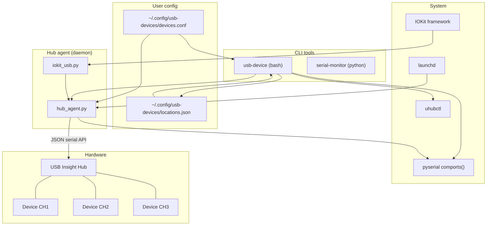
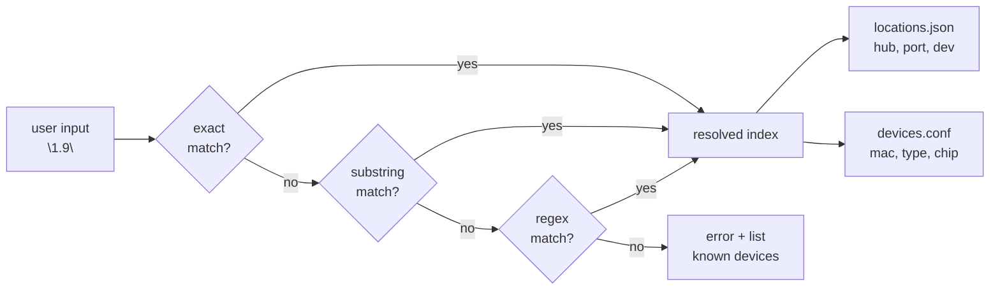
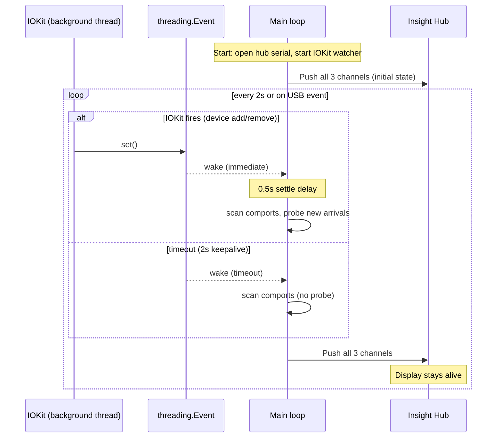
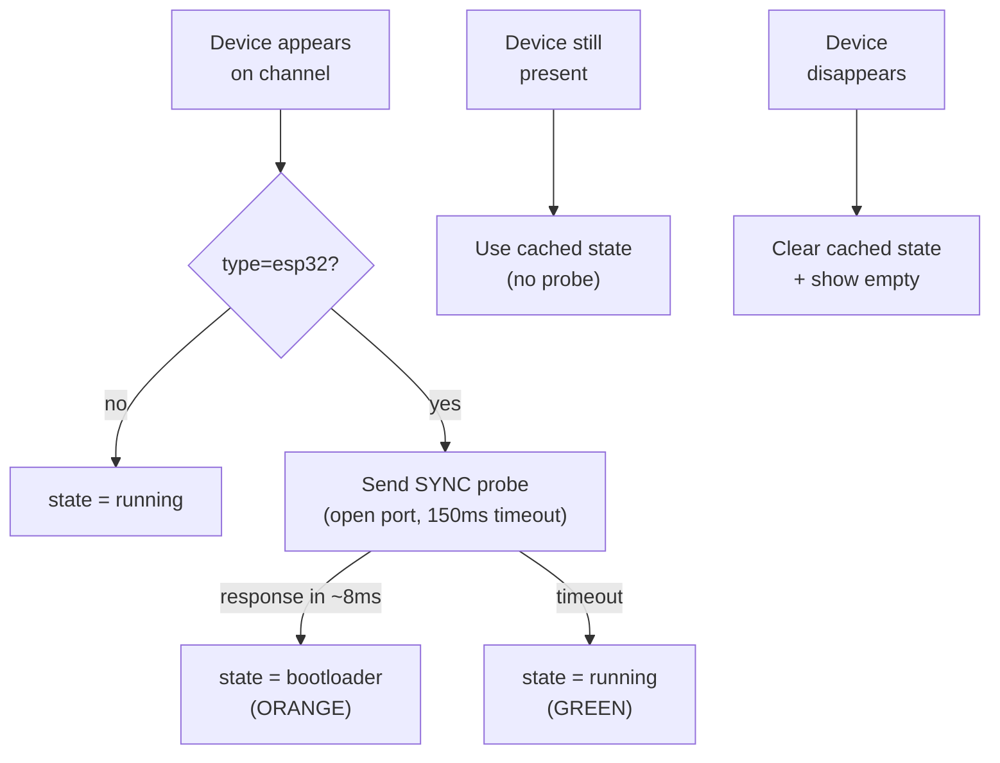
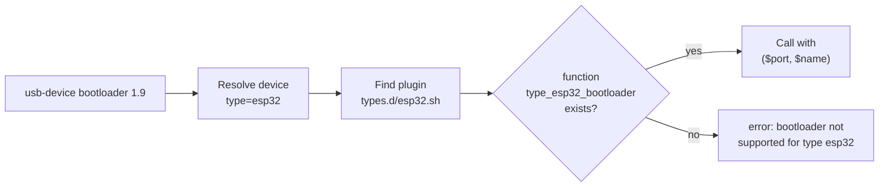

# Design Notes

Technical details for developers working on the usb-device tools. For usage, see [README.md](README.md).

## System overview



## Device resolution

All commands that take a device name go through the same resolution pipeline:



Once resolved, the device's hub/port/serial info comes from two sources: live data from pyserial/uhubctl, or cached data from `locations.json` if the device is offline.

## USB Insight Hub agent

### Hub hardware

The [USB Insight Hub](https://www.crowdsupply.com/aerio-solutions/usb-insight-hub) is a 4-port USB 2.0 hub with per-port TFT displays. Internally:

```
Hub (e.g. 20-3.3)
├── Port 1 → CH1 display + upstream device
├── Port 2 → CH2 display + upstream device
├── Port 3 → CH3 display + upstream device
└── Port 4 → ESP32 controller (CDC serial, runs the displays)
```

The controller exposes a JSON serial API at 115200 baud (DTR asserted). We send display commands and receive `{"status":"ok"}` responses.

### Channel mapping

Devices are mapped to hub channels by USB topology, not by port path. Given a hub at location `20-3.3`:

| Device location | Channel |
|----------------|---------|
| `20-3.3.1`     | CH1     |
| `20-3.3.2`     | CH2     |
| `20-3.3.3`     | CH3     |
| `20-3.3.1.2`   | CH1 (behind sub-hub on port 1) |
| `20-4.1`       | None (different hub) |

The first segment after the hub prefix determines the channel.

### Display protocol

The hub supports a special text mode (`numDev=10`) with up to 3 lines of 14 characters, each with independent color:

```json
{"action":"set","params":{"CH1":{
  "Dev1_name":{
    "T1":{"txt":"MPCB 1.9 Devel","color":"GREEN"},
    "T2":{"txt":"bootloader","color":"ORANGE"}
  },
  "numDev":"10","usbType":"2"
}}}
```

Colors: `GREEN`, `RED`, `ORANGE`, `CYAN`, `DARKGREY`, `WHITE`.

### Activity timeout

The hub firmware clears display text after **4.5 seconds** of serial silence (hardcoded `clearScreenText` timer in `taskExterCheckActivity`). The agent must push display state at least this often. We use a **2 second** keepalive interval to stay well within the window.

### Event loop



The `threading.Event.wait(timeout=2.0)` serves double duty: it sleeps for the keepalive interval, but wakes immediately when IOKit signals a USB change. This gives instant response to connect/disconnect while maintaining the keepalive cadence.

### IOKit USB notifications

`iokit_usb.py` is a ~100-line ctypes bridge to two macOS system frameworks:

| Framework | Functions used | Purpose |
|-----------|---------------|---------|
| **IOKit** | `IONotificationPortCreate`, `IOServiceAddMatchingNotification`, `IOIteratorNext`, `IOObjectRelease` | Subscribe to USB device add/remove events |
| **CoreFoundation** | `CFRunLoopGetCurrent`, `CFRunLoopAddSource`, `CFRunLoopRunInMode`, `CFRunLoopStop` | Run the event loop on a background thread |

The bridge registers for `IOServiceFirstMatch` (device added) and `IOServiceTerminate` (device removed) notifications on `IOUSBHostDevice` objects. Callbacks fire on the background thread and signal the main loop via `threading.Event`.

No third-party dependencies. These are stable C ABI system frameworks present on every macOS version since 10.0.

### Bootloader detection

ESP32 devices in ROM bootloader mode are detected by sending a SYNC probe:

```
TX: SLIP frame → [0x00, 0x08, len, 0x00000000, 0x07071220, 55×32]
RX (bootloader): SLIP response with cmd 0x08 in ~8ms
RX (running app): silence, timeout after 150ms
```

This uses the same protocol as esptool's initial handshake. The probe is only run for `type=esp32` devices, and only on first appearance (not every poll cycle) to avoid the 150ms overhead and serial port contention.



### Hub reconnect

The agent handles hub disconnection and reconnection:

1. `_send()` catches `OSError` and sets `_hub_lost = True`
2. Main loop calls `_reconnect()` which re-runs `find_insight_hub()` auto-detection
3. Hub may enumerate on a different `/dev/cu.*` path after replug — auto-detection handles this
4. On reconnect, all cached display/channel state is cleared for a clean start

In daemon mode (LaunchAgent), the agent also handles the hub not being present at startup — it waits and retries every 2 seconds until the hub appears.

### LaunchAgent

`usb-device hub install` generates a macOS LaunchAgent plist:

| Key | Value | Why |
|-----|-------|-----|
| `RunAtLoad` | `true` | Start on login |
| `KeepAlive` | `true` | Restart if it exits |
| `ThrottleInterval` | `10` | Min 10s between restarts |

Plist: `~/Library/LaunchAgents/com.usb-devices.hub-agent.plist`
Log: `~/Library/Logs/hub-agent.log`

## Type plugins

Type plugins are bash scripts that add board-specific commands. They're loaded by sourcing the file, then calling convention-named functions:



Plugin search order (first match wins):
1. `<script-dir>/types.d/<type>.sh` — shipped defaults
2. `~/.config/usb-devices/types.d/<type>.sh` — user overrides

## File layout

```
scripts/usb-devices/
├── usb-device              # Main CLI tool (bash)
├── serial-monitor          # Serial monitor wrapper (bash → python)
├── serial_monitor.py       # Serial monitor implementation
├── hub-agent               # Hub agent wrapper (bash → python)
├── hub_agent.py            # Hub agent daemon
├── iokit_usb.py            # IOKit ctypes bridge (macOS USB events)
├── setup.sh                # First-time setup script
├── devices.conf.example    # Example device registry
├── types.d/
│   └── esp32.sh            # ESP32 type plugin (bootloader, boot)
├── test/
│   ├── usb-device.bats     # Integration tests (real hardware)
│   └── usb-device-mock.bats # Unit tests (mocked environment)
├── .gitignore
├── README.md               # User documentation
└── DESIGN.md               # This file
```

## User config

All user state lives outside the repo in `~/.config/usb-devices/`:

| File | Format | Managed by |
|------|--------|-----------|
| `devices.conf` | INI (sections) or flat (`NAME=MAC`) | User edits manually |
| `locations.json` | JSON `{name: {hub, port, dev, mac, last_seen}}` | `usb-device scan` |
| `locks/` | JSON files per device | `usb-device checkout/checkin` |
| `types.d/` | Bash scripts | User creates manually |
